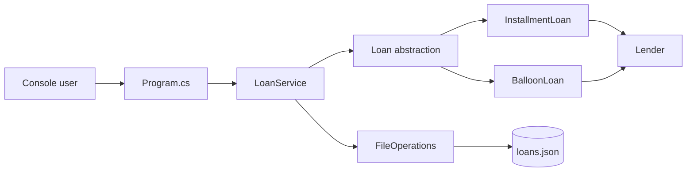
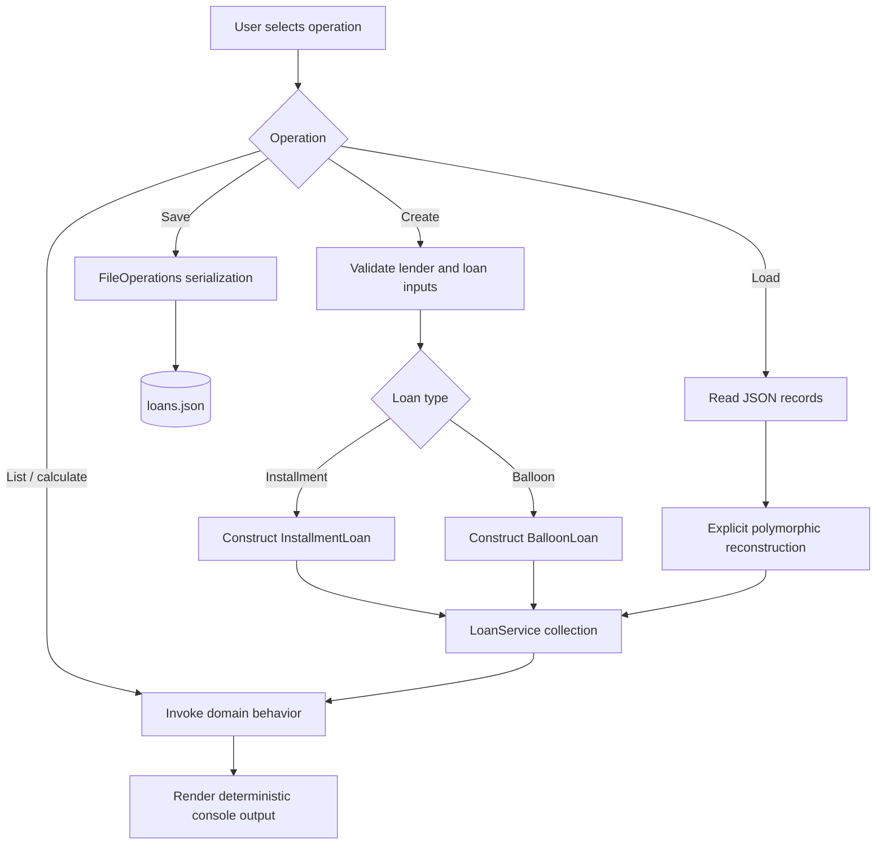

# Software3-Lab

[](https://github.com/CoreyLeath-code/Software3-Lab/actions/workflows/ci.yml)
[](https://dotnet.microsoft.com/)
[](tests/LoanTests.cs)
[](benchmarks/Program.cs)
[](Dockerfile)
[](LICENSE)
[](https://github.com/CoreyLeath-code/Software3-Lab/commits/main)

**Software3-Lab** is a .NET 8 loan-tracking reference application built around explicit domain rules, deterministic financial calculations, JSON persistence, automated correctness tests, and reproducible microbenchmarks. It supports amortized installment loans and interest-only balloon loans while keeping the evidence boundary explicit: this repository demonstrates software-engineering behavior, not lending approval, underwriting, regulatory compliance, or production financial authorization.

## Engineering scope

### Verified in the repository

- amortized installment-loan monthly-payment calculation
- zero-interest installment boundary handling
- interest-only balloon payment and final-principal calculation
- domain input validation
- heterogeneous loan records reconstructed from JSON
- application-level loan collection management
- nullable-reference analysis and warnings-as-errors
- xUnit correctness tests with TRX and coverage collection
- BenchmarkDotNet microbenchmarks with managed-memory diagnostics
- GitHub Actions restore/build/test/benchmark pipeline
- multi-stage .NET 8 container running as a non-root user

### Explicitly not claimed

- lending, underwriting, credit-risk, or eligibility decisions
- production authorization or regulatory compliance
- transactional database durability or distributed persistence
- service/API availability, horizontal scaling, or concurrent-load capacity
- end-to-end production latency or SLOs
- benchmark portability across hardware or runtime versions

## Architecture flowchart



The executable boundary is a console application. `LoanService` coordinates collections of domain objects; loan subclasses own calculation behavior; `FileOperations` provides local JSON persistence.

## System design flow



### Component responsibilities

| Concern | Verified implementation |
|---|---|
| Runtime | .NET 8 / C# |
| Entry point | `Program.cs` |
| Domain model | `Domain/` |
| Application service | `Services/LoanService.cs` |
| Persistence | `Domain/FileOperations.cs` + `System.Text.Json` |
| Correctness | xUnit + Microsoft.NET.Test.Sdk |
| Performance | BenchmarkDotNet 0.14.0 |
| CI | `.github/workflows/ci.yml` |
| Packaging | Multi-stage `Dockerfile` |

## Quick Start

### Prerequisites

- .NET 8 SDK
- Git
- Docker only if you want to exercise the container path

### Clone and verify

```bash
git clone https://github.com/CoreyLeath-code/Software3-Lab.git
cd Software3-Lab

dotnet restore Software3-Lab.sln
dotnet build Software3-Lab.sln --configuration Release --no-restore
dotnet test Software3-Lab.sln --configuration Release --no-build
```

### Run the application

```bash
dotnet run --project LoanTracker.csproj
```

The console flow supports creating installment and balloon loans, listing loan records, and saving/loading local `loans.json` state.

### Run the benchmark suite

```bash
dotnet run \
  --project benchmarks/LoanTracker.Benchmarks.csproj \
  --configuration Release \
  --no-build \
  -- \
  --filter "*"
```

BenchmarkDotNet writes CSV, GitHub-flavored Markdown, and HTML reports beneath `BenchmarkDotNet.Artifacts/results/`.

### Build and run the container

```bash
docker build -t software3-lab .
docker run --rm -it -v "${PWD}:/data" software3-lab
```

The runtime stage uses the .NET 8 runtime rather than the SDK and executes as the image's non-root `APP_UID`.

## Evidence and reproducibility

The repository treats claims as reviewable evidence rather than README decoration. The CI workflow runs the named solution in Release mode and uploads test/benchmark artifacts.

| Claim | Evidence path | Reproduction command |
|---|---|---|
| Solution restores | `Software3-Lab.sln`, CI Restore step | `dotnet restore Software3-Lab.sln` |
| Release build succeeds | CI Build step | `dotnet build Software3-Lab.sln --configuration Release --no-restore` |
| Domain cases pass | `tests/LoanTests.cs`, TRX artifact | `dotnet test Software3-Lab.sln --configuration Release --no-build` |
| Core operations are benchmarked | `benchmarks/Program.cs` | Benchmark command above |
| Evidence is retained | `dotnet-quality-results` CI artifact | inspect successful workflow run |
| Runtime image is reproducible | `Dockerfile` | `docker build -t software3-lab .` |

### Clean-checkout reproduction protocol

For a defensible result, record:

1. Git commit SHA.
2. Operating system and CPU model.
3. `dotnet --info` output.
4. Restore/build/test command and exit status.
5. BenchmarkDotNet report files without hand-editing measurements.
6. Any deviation from the checked-in benchmark configuration.

A benchmark result should be treated as belonging to that commit/runtime/hardware combination. It should not silently replace measurements from another environment.

## Correctness evidence

The current checked-in correctness suite uses fixed inputs with exact expected decimal behavior.

| Test objective | Input | Expected result | Recorded status |
|---|---:|---:|---|
| Amortized payment | $10,000, 5% APR, 3 years | $299.71/month | Pass |
| Zero-interest boundary | $1,200, 0% APR, 1 year | $100.00/month | Pass |
| Balloon payment | $12,000, 6% APR | $60/month; $12,060 final | Pass |
| Invalid principal | $0 | `ArgumentOutOfRangeException` | Pass |

The documented reference run recorded **4/4 passing tests**. That is a test-case pass rate only; it must not be interpreted as 100% statement, branch, mutation, or requirements coverage.

## Research-style benchmark and metrics

### Research question

What is the steady-state execution cost of the repository's core calculation and presentation paths under a controlled .NET 8 microbenchmark environment?

### Experimental protocol

The checked-in BenchmarkDotNet suite uses preconstructed domain objects so measured calculation operations exclude object-setup cost. The documented reference configuration uses:

- BenchmarkDotNet 0.14.0
- one process launch
- three warm-up iterations
- five measurement iterations
- managed-memory diagnostics
- .NET 8 x64 RyuJIT

Documented reference environment:

- GitHub-hosted Ubuntu 24.04.4 LTS runner
- AMD EPYC 7763
- 2 physical / 4 logical cores exposed
- .NET 8.0.29
- AVX2 available
- concurrent workstation GC
- measured July 19, 2026

### Reference measurements

| Workload | Mean latency | 99.9% CI half-width | Std. dev. | Derived throughput | Allocation/op |
|---|---:|---:|---:|---:|---:|
| Installment monthly payment | 293.2 ns | 6.89 ns | 1.79 ns | ~3.41 M ops/s | 0 B |
| Balloon monthly payment | 153.4 ns | 4.21 ns | 0.65 ns | ~6.52 M ops/s | 0 B |
| Format installment loan | 911.9 ns | 14.25 ns | 3.70 ns | ~1.10 M ops/s | 344 B |

**Important:** throughput above is mathematically derived as `1 second / mean latency`. It is not a separately measured concurrent-load or service-throughput experiment.

### Interpretation

- The two measured payment calculations were allocation-free in the documented steady-state benchmark.
- Balloon calculation has less arithmetic work than the amortization path in this implementation and measured lower latency in the reference run.
- Formatting creates a display string and therefore measured both higher latency and 344 B of allocation per operation.
- These measurements are useful for regression baselines inside this codebase; they are not evidence of application-scale capacity.

### Threats to validity

- GitHub-hosted runners are shared infrastructure and can vary between executions.
- A microbenchmark isolates code paths and does not model interactive console input, JSON I/O, startup, disk latency, concurrency, or sustained traffic.
- CPU architecture, .NET patch version, JIT behavior, power management, and host contention can shift results.
- Five measurement iterations are appropriate for this portfolio baseline but do not establish universal performance distributions.
- No financial-quality conclusion follows from execution speed.

## CI evidence contract

On pushes and pull requests targeting `main`, `.github/workflows/ci.yml` performs:

```text
Checkout
   |
   v
Setup .NET 8
   |
   v
Restore solution
   |
   v
Release build
   |
   v
xUnit tests + TRX + coverage collection
   |
   v
BenchmarkDotNet suite
   |
   v
Upload dotnet-quality-results artifact
```

A merge-ready change should preserve a warning-clean Release build, passing correctness suite, completed benchmark run, and retained evidence artifacts.

## Repository layout

```text
.
├── Domain/                 Loan entities and JSON persistence
├── Services/               Application service
├── tests/                  xUnit correctness suite
├── benchmarks/             BenchmarkDotNet performance suite
├── .github/workflows/      CI automation
├── LoanTracker.csproj      Console application project
├── Software3-Lab.sln       Complete build graph
├── Metrics.Md              Recorded quality/performance evidence
├── BUILD_VERIFICATION.md   Build verification notes
└── Dockerfile              Multi-stage runtime image
```

## Reviewer Q&A

**Is this a production lending system?**  
No. It is a reference application demonstrating domain modeling, calculation behavior, persistence, testing, benchmarking, CI, and containerization. It does not perform underwriting or establish regulatory readiness.

**Why use decimal expectations for financial calculations?**  
The tests assert explicit monetary outcomes and avoid presenting floating-point approximation as a business rule. Reviewers should inspect the domain implementation and test vectors for the exact rounding behavior.

**What does “4/4 tests passed” prove?**  
Only that the four checked-in cases passed in the recorded run. It does not prove exhaustive correctness or full code coverage.

**Are the benchmark throughput numbers load-test results?**  
No. They are derived from single-operation mean latency. No concurrent request workload is claimed.

**Why benchmark formatting separately from calculation?**  
It distinguishes computational behavior from string creation/allocation and makes regression analysis more informative.

**Why is the architecture intentionally small?**  
The current executable is a local console application. Introducing APIs, queues, distributed storage, or orchestration solely to make the diagram look larger would misrepresent the implemented system.

**What happens to persisted data?**  
The current persistence boundary is local JSON (`loans.json`). The repository does not claim transactional database semantics.

**How should a reviewer reproduce the numbers?**  
Use a clean checkout, run the documented Release-mode commands, preserve BenchmarkDotNet's generated reports, and record the commit/runtime/hardware context.

**What is the strongest engineering evidence here?**  
The combination of explicit domain behavior, deterministic tests, a reproducible CI build graph, benchmark artifacts, and clearly stated limitations.

**What would invalidate a performance comparison?**  
Changing hardware/runtime/configuration, including setup work in one measurement but not another, or comparing derived throughput with a real concurrent-load test as if they were equivalent.

## Engineering roadmap

The roadmap is intentionally evidence-gated. Items are future work, not current capabilities.

### Phase 1 — strengthen domain correctness

- expand parameterized tests across principal/rate/term boundaries
- add explicit rounding-policy tests for monetary outputs
- add save/load round-trip and malformed-input tests
- report statement/branch coverage separately from test pass rate

**Exit evidence:** CI artifacts showing expanded test vectors, documented coverage, and deterministic persistence round trips.

### Phase 2 — persistence hardening

- define a versioned persistence schema
- add atomic-write/recovery behavior for local state
- test corrupted, partial, and incompatible persisted records
- document migration/backward-compatibility policy

**Exit evidence:** fault-injection tests and versioned fixtures demonstrating recovery behavior.

### Phase 3 — benchmark rigor

- add repeatable baseline comparison tooling
- record commit SHA and runtime metadata alongside benchmark artifacts
- define statistically justified regression thresholds
- separate microbenchmark, persistence, startup, and end-to-end experiments

**Exit evidence:** machine-readable benchmark history with reproducible comparison methodology.

### Phase 4 — supply-chain and release engineering

- add semantic-version GitHub Release automation
- publish checksums for release artifacts
- build and publish a versioned GHCR image
- generate an SBOM and scan release images before publication
- sign published container artifacts

**Exit evidence:** a tagged release that can be independently downloaded, checksum-verified, scanned, and traced to a commit.

### Phase 5 — service boundary only if required

If the project evolves beyond a local lab application, introduce an API or database only when a concrete requirement justifies it. At that point, add integration tests, health/readiness contracts, observability, concurrency/load experiments, and rollback evidence before making service-level claims.

## License

MIT. See [LICENSE](LICENSE).
